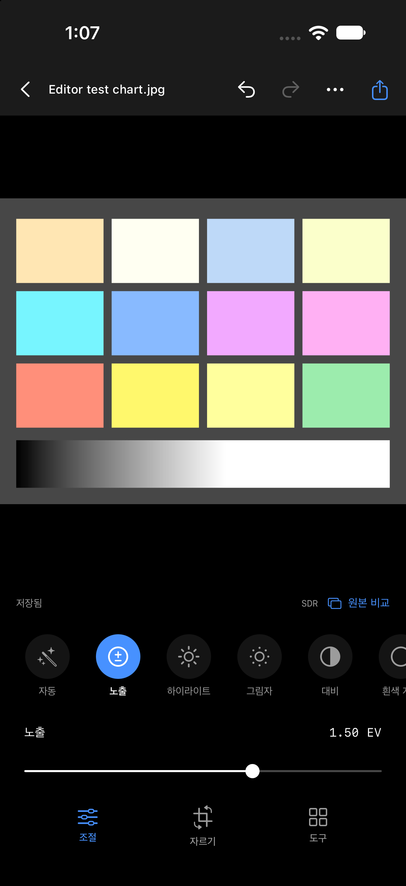
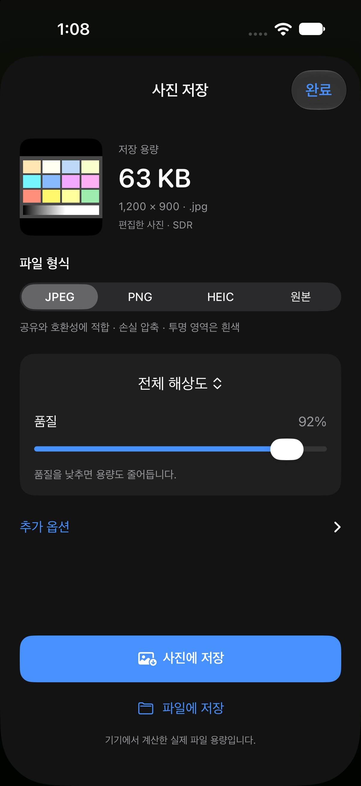
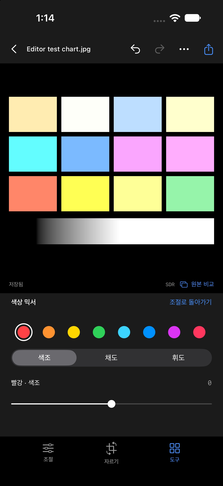

# 사진 중심 편집·저장 UI 및 반응성 검증

2026-09-29 · Xcode 27 / Swift 6.4 · macOS 엔진 테스트 + iOS 27 Simulator.

## 변경

- 저장 형식은 JPEG, PNG, HEIC, 원본의 네 가지로 고정. 단일/일괄 저장에서 같은 목록을 사용합니다. TIFF/AVIF 인코더는 기존 엔진 호환 및 테스트용으로 유지하지만 저장 선택지에서 제외했습니다.
- 저장 화면: 썸네일, 실제 인코딩 용량, 출력 픽셀/확장자, 형식, 크기, 품질. 색 공간/HDR/워터마크는 추가 옵션에 있습니다. 준비한 파일을 재사용해 사진/파일에 저장합니다.
- 기본 편집: 수평 조절 항목 목록과 선택한 항목의 슬라이더 하나. 조절/자르기/도구 세 모드. 히스토그램은 메뉴에서 켭니다. HSL, 그레이딩, 깊이, HDR 확장, 부분 보정도 수치 항목을 하나씩 선택합니다.
- 사진 추가: 최근 사진 3열 그리드, 선택 순서, 앨범, 파일/카메라가 있는 하단 시트를 유지합니다.

## 느린 반영의 원인과 수정

기존에는 매 입력마다 렌더 작업을 취소하고 70ms 대기를 다시 시작했습니다. 16ms 간격의 연속 입력은 미리보기를 갱신하지 못했습니다. 렌더 후 히스토그램 계산도 별도 렌더를 수행했으며 단일 소스 캐시의 해상도를 교체했습니다.

이제 진행 중 렌더는 완료하고 다음 요청 한 개만 최신 값으로 바꿉니다. 후속 사용자 요청으로 조작 중 렌더 시작 간격을 최소 33.334ms(최대 30회/초)로 제한했습니다. 정밀 렌더/비교/undo 요청은 제한 대기를 취소합니다. 조작 중 긴 변 768px, 손을 떼거나 입력이 180ms 멈추면 1536px로 렌더합니다. 원본보다 확대하지 않습니다. 비교/실행 취소/확정/화면 종료는 세대 번호로 이전 결과를 거부합니다. 히스토그램은 켰을 때 정밀 렌더 뒤 갱신합니다.

디코딩된 프록시는 linear sRGB RGBAh CGImage로 한 번 구체화하고 NSCache에 보관합니다(4개/48MiB 한도). 해상도, HDR, RAW 현상 설정이 캐시 키에 포함됩니다. full-resolution 출력은 프록시를 사용하지 않습니다. 렌더/캐시/파일 작업은 EditingService actor에 있습니다.

## 합성 드래그 측정 (30회 제한 적용 전 기록)

별도 Velyn Import UI Test 시뮬레이터, EditorSmokeFixture의 1200×900 합성 차트. MainActor에서 노출 0→1.5 EV를 16ms 간격으로 80회 설정하고 finishGesture를 호출했습니다. 실제 터치 이벤트나 화면 표시 FPS를 측정한 것은 아닙니다.

| 항목 | 수정 전 | 수정 후 |
| --- | ---: | ---: |
| 입력 80회 소요 | 1.378s | 1.366s |
| 입력 중 UI에 전달된 미리보기 | 0회 | 80회 |
| 손을 뗀 뒤 최종 결과 대기 | 342ms | 21ms |
| 마지막 recipe와 미리보기 일치 | true | true |
| 최종 이미지 너비 | 1200px | 1200px |

원시 결과: [수정 전](interaction-before-2026-09-29.json), [수정 후](interaction-after-2026-09-29.json).
수정 후 빠른 원본 비교, undo/redo, flush 후 재시작의 최종 미리보기 일치도 모두 true입니다.
이 수치는 Mac에서 실행한 Simulator의 합성 결과입니다. A17 Pro, 48MP RAW, 복잡한 마스크/ML 처리 성능이나 60fps 보장이 아닙니다.

## 자동 검증

- `./Scripts/verify.sh`: 56 tests / 7 suites 성공, iOS Simulator build 성공.
- 필수 JPEG/PNG/HEIC와 네 가지 저장 목록 검사.
- 캐시의 크기 교체/히스토그램/HDR 왕복 후 SDR 픽셀 및 투명도 동일, 원본 해시 검증.
- 기존 실제 PNG/JPEG/HEIC 인코딩, 실제 파일 용량, full-resolution 크기, 원본 바이트 보존 검사를 포함합니다.
- 서명 iOS Release build 성공. 실기기는 연결 불가여서 이번 변경의 설치·실기기 조작/성능 확인은 대기 중입니다.

## 화면

합성 차트와 명시적 Debug 진입 인자로 확인했습니다. JPEG/PNG/HEIC 선택 시 각각 실제 준비 파일의 용량과 확장자 표시를 확인했으며 PNG에는 품질 슬라이더가 없습니다. PNG/HEIC 캡처는 드래그·undo/redo 검사 뒤의 노출/대비 보정이 적용된 합성 차트입니다. 모든 시스템 저장/권한 버튼을 터치한 end-to-end 검증은 아닙니다.

최종 UI 빌드: `.work/focused-ui-build.log`, 서명 기기 빌드: `.work/focused-iphone-build.log` 모두 BUILD SUCCEEDED. 연결 재확인에서도 실제 iPhone은 unavailable입니다.

## 후속: 드래그 중 최대 30회/초 제한

사용자 요청에 따라 표시 단계가 아닌 렌더 시작 전 단계에서 제한합니다. 33,333,334ns보다 빨리 다음 interactive render를 시작하지 않습니다. 입력이 더 들어와도 마감 시각은 연장하지 않으며, 대기 후 최신 pending 값만 처리합니다. 손을 떼면 pacing task를 취소해 마지막 정밀 렌더가 대기에 막히지 않습니다. 대기·렌더 모두 화면 종료 시 취소합니다.

같은 Simulator/1200×900 합성 차트, 노출 변경 80회 결과:

- 입력 시간 1.371초, 조작 중 렌더/미리보기 40회(약 29.2회/초).
- 관측된 최소 렌더 시작 간격 33.500ms. 모든 간격이 1/30초 이상.
- 정밀 결과 대기 약 20.7ms, 최종 recipe 일치.
- 빠른 두 번 입력 직후 완료의 최종 값 일치, idle 250ms 동안 추가 렌더 없음.
- 비교/undo·redo/flush 이후 재개 모두 최종 상태 일치.
- [원시 결과](interaction-30fps-2026-09-29.json).

이 검사는 CPU/GPU 에너지 또는 실제 iPhone 온도를 측정하지 않았습니다. 불필요한 렌더 횟수를 줄였다는 근거이며 발열 감소량은 실기기 측정이 필요합니다. 기존 56개 엔진 테스트 이후 엔진 변경 없이 UI 스케줄러와 Debug 검증만 변경했습니다. Simulator 및 서명된 iOS Release 빌드를 확인했습니다.
