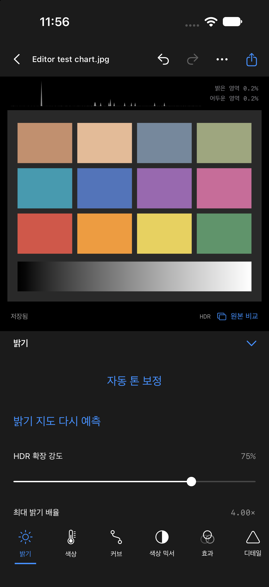

# SDR → HDR 밝기 지도 검증

2026-09-29. 로컬 Mac, Xcode 27 / Swift 6.4 / iOS 27 시뮬레이터에서 실행했습니다.
실제 iPhone의 화면·메모리·발열·지연 또는 Lightroom 품질 동등성을 검증한 결과가 아닙니다.

## 구현

- 공개 GMNet real-world 가중치를 Core ML FP16으로 변환해 앱에 포함했습니다. 약 1.92M 파라미터, 패키지 약 3.9MB.
- 현재 SDR 편집본에서 512px 분석 입력과 256px 전역 입력을 생성합니다. 원본 파일은 수정하지 않습니다.
- 픽셀별 log2 gain을 예측하고 0…log2(5)로 제한합니다. 강도 기본값은 75%, 최대 배율 기본값은 4×입니다.
- 사진별 UUID의 16-bit PNG에 수치를 저장하고 undo/redo·재열기에서 재사용합니다. 내보내기는 원본 해상도로 렌더링합니다.
- 선형 RGB 각 채널에 같은 배율을 곱합니다. 사진의 색 비율과 투명도를 유지하며 기하 변환 전 좌표로 적용합니다.
- HDR JPEG/HEIC는 예측 HDR과 동일 편집의 SDR base를 함께 writer에 전달합니다. SDR 내보내기에는 밝기 지도 효과가 적용되지 않습니다.
- 원본 HDR/ISO gain map이나 HDR headroom이 있는 입력, RAW 입력은 기존 HDR 처리 경로를 사용합니다.
- 서버·네트워크 추론·사진 업로드 없이 실행합니다. 별도 서버 작업은 수행하지 않았습니다.

## 자동 테스트

`./Scripts/verify.sh` 성공: **50개 테스트, 6개 suite**, iOS Simulator 빌드 성공.
`generic/platform=iOS`, `CODE_SIGNING_ALLOWED=NO` 기기 대상 빌드 성공.
유일한 빌드 경고는 AppIntents 의존성이 없어 메타데이터 추출을 건너뛴다는 Xcode 안내였습니다.

새 5개 테스트:

1. 선형 밝기 배율, 1 초과 HDR 값, 색 비율·알파·검정 보존, 강도 0의 동일성.
2. 비대칭 16-bit 지도 저장/읽기의 값과 방향, 회전·자르기 정렬.
3. 기존 문서의 선택적 필드 디코딩, 수치 유효성, undo/redo, 프리셋에서 지도 제외.
4. 실제 번들 모델 추론, 저장 후 재열기, HDR JPEG 보조 gain map과 HDR 값, SDR fallback 비교, 기존 HDR 입력에 새 추론 거부, 원본 SHA 검증.
5. 취소된 추론이 지도 파일을 남기지 않음.

합성 표본: `Tests/VelynEngineTests/GainMapTests.swift`가 생성하는 240×180 흰색/회색 비대칭 JPEG. 실제 사용자 사진은 사용하지 않았습니다.

## 변환 수치 비교

[원본 JSON](gain-map-conversion.json). 고정 난수 입력과 검정·중간 회색·흰색 입력 4개에서 Core ML과 PyTorch를 비교했습니다. 최대 오차는 약 **0.002102 EV**였습니다. 이는 변환 수치 검증이며 사진 품질 지표가 아닙니다. FP16 출력의 미세한 범위 초과는 앱에서 저장 전에 다시 제한합니다.

학습 코드의 real-world peak 정규화(log2(5))를 되돌립니다. 연구 예제의 gamma 2.2 대신 앱은 Core Image의 sRGB 색 변환을 사용합니다. 이 차이와 음수 gain 제거는 실제 사진 평가가 필요합니다.

## 앱 실행 확인

**후속 정정:** 아래 초기 smoke 결과는 파일 생성만 확인했으며 실제 HDR 픽셀을 확인하지 않았습니다. iOS 27 Simulator CPU/GPU 실행에서 0으로 채워진 출력이 발견되어 기준 입력 검증과 CPU 재시도를 추가했습니다. 최신 결과는 [HDR 보정 지표 검증](hdr-diagnostics-verification.md)에 있습니다.

기존 iPhone 18 Pro 시뮬레이터에서 `--editor-smoke-test --editor-smoke-gain`으로 실행했습니다.
`EditorSmokeFixture`가 생성한 합성 색상 차트와 별도 저장소만 사용했습니다.

[실행 보고서](gain-map-smoke-report.json): generated, undo, redo, saved, jpeg, heic 모두 true, error 빈 문자열.
UI 스크린샷에서 지도 재예측, 확장 강도 75%, 최대 배율 4×와 HDR 상태 표시를 확인했습니다.
자동화가 EditorStore를 직접 호출한 결과이며 모든 버튼의 실제 터치 조작을 검증한 결과는 아닙니다.

## 남은 수락 항목

- 실제 iPhone의 HDR 화면과 SDR fallback, 다양한 뷰어의 JPEG/HEIC 호환성.
- 실사진의 피부·흰 벽·광원·작은 밝은 물체·경계 후광, P3 색과 장면별 품질.
- 12/48MP 입력에서 최대 메모리·지연·발열, 저장 공간 부족과 실행 중 취소.
- 현재 지도 확대는 선형 보간입니다. 경계 보존 확대나 고해상도 타일 추론은 구현하지 않았습니다.
- 소실된 하이라이트 디테일을 복원하거나 원래 장면의 실제 휘도를 재현한다는 보장은 없습니다.

C01–C10, A17 Pro 성능, 출시 또는 Lightroom 전체 기능 동등성 수락은 완료로 표시하지 않습니다.
