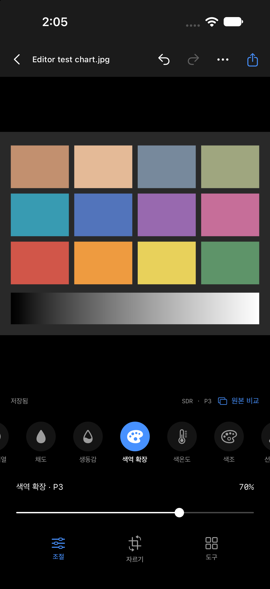
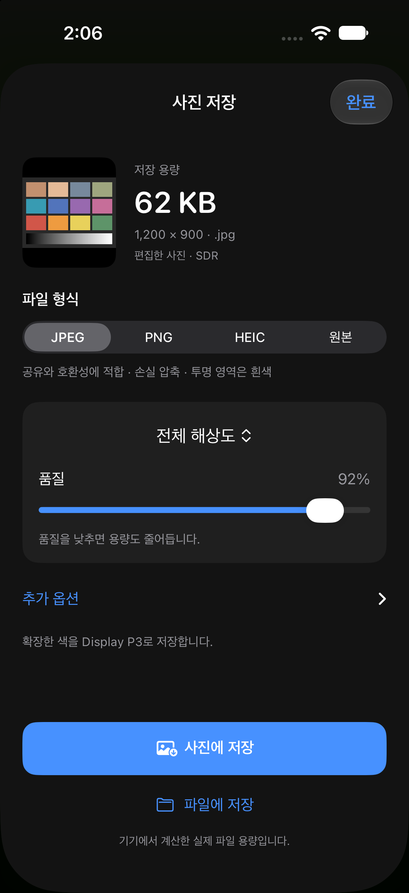

# P3 색역 확장 검증

2026-09-29 · Xcode 27 / Swift 6.4. 모든 입력은 코드로 만든 합성 색상/차트입니다.

## 구현

- GamutExpansion.swift: 선형 P3에서 Y를 보존하고 sRGB와 P3 경계 사이로 채도를 확장하는 33³ LUT. 기본 강도 0, 최대 100%. 원본 복원/학습 추론이 아닌 보간 기반 색 보정입니다.
- 낮은 채도/중성색 유지 및 넓은 주황 계열 확장 완화. 실제 피부/사물 인식을 수행하지 않습니다.
- LUT는 렌더 경로에서 한 번 만들고 재사용합니다. 강도는 CIDissolveTransition으로 혼합하며 기존 최대 30회/초 요청 제한을 유지합니다.
- SDR 미리보기 및 상세 픽셀 출력은 Display P3. HDR 미리보기는 extended linear Display P3. 저장 시 색역 확장을 썼으면 Display P3가 초기 선택됩니다. sRGB를 직접 선택할 수 있으며 색 축소 안내가 표시됩니다.
- JPEG/PNG/HEIC/원본의 네 가지 저장 목록 유지. 원본 파일은 복사만 수행합니다.

## 근거

색 변환 행렬은 [W3C CSS Color 4의 D65 색 변환](https://www.w3.org/TR/css-color-4/#color-conversion-code)을 사용했습니다. 설치 iOS 27 SDK의 CIFilterBuiltins.h에서 CIColorCubeWithColorSpace 및 extrapolate(iOS 16+)를 확인하고 양 플랫폼 컴파일했습니다.

처음 검토한 working-sRGB cube는 일부 full-resolution 출력 경로에서 음수 채널이 소실됐습니다. 최종 구현은 명시적인 선형 Display P3 cube이며 아래 테스트는 미리보기뿐 아니라 실제 출력의 sRGB 밖 색상도 확인합니다.

## 자동 검증

`./Scripts/verify.sh`: 60 tests / 8 suites 성공, iOS Simulator build 성공.
추가 GamutExpansionTests:

- 0–5 선형 중성 밝기에서 회색/흰색 및 HDR headroom 유지. Core Image 색 변환/LUT의 유한 정밀도를 고려해 SDR 절대 오차 0.003, HDR 상대 오차 0.2%, 채널 간 차이 0.0005 이내를 검사합니다.
- 녹색 표본이 실제로 sRGB 밖(선형 sRGB R < -0.01)으로 확장되고 P3 안에 남는지 확인.
- 강도 0/50/100의 보간, 알파 0/0.6 보존, 선형 Y 보존.
- 기본값/직렬화/undo/redo/프리셋 전달/원본 비교 및 범위 검증.
- JPEG·PNG·HEIC 각각 전체 240×180 출력, P3 프로파일, 확장 색 유지. 같은 설정의 sRGB 출력은 좁은 색역으로 변환됨을 확인.
- 기본 미리보기와 원본 픽셀 미리보기의 확장 색 보존, 원본 SHA 및 바이트 복사 일치.

이는 실사진의 지각 품질, A17 Pro 발열·전력, 실제 P3 디스플레이 측정, NPU 실행 증거가 아닙니다. 이번 구현은 NPU/신경망을 사용하지 않습니다.

## 앱 화면·갱신·설치

- 합성 1200×900 차트에서 색역 확장 70%를 켜고 입력 80회: 1.375초 동안 렌더 40회, 최소 시작 간격 33.532ms. 최대 30회/초 제한 통과, 완료 후 최종 결과 약 21.5ms. 비교/undo/redo/대기/재개와 마지막 값 일치. [원시 결과](gamut-interaction-2026-09-29.json). Simulator 수치이며 실제 iPhone 성능이 아닙니다.
- 명시적 Debug 인자로 조절 선택 및 저장 화면 진입. P3 기본 저장 안내 확인. 캡처 자체로 광색역 디스플레이 품질을 판정하지 않습니다.
- 서명 Release 빌드 성공(`.work/gamut-iphone-build.log`). iPhone 15 Pro에 같은 bundle ID로 업데이트 설치 성공(`.work/gamut-device-install.json`).
- 실행 요청은 기기 잠금 때문에 Locked로 거부됐습니다(`.work/gamut-device-launch.json`). 앱 설치는 완료했지만 이번 버전의 실기기 실행/색/발열 검증은 아직 하지 않았습니다.

