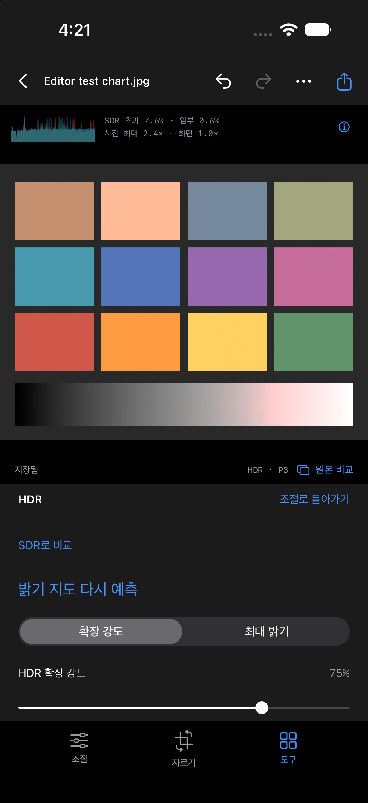

# HDR 보정 지표와 밝기 지도 검증

2026-09-29. 사용자 보고: HDR 적용 시 너무 밝아지거나 색이 이상함. 아래 결과는 macOS 엔진 및 iOS 27 Simulator 검증입니다. iPhone 15 Pro에 서명 Release를 설치하고 실행했지만 실제 화면의 색·밝기에 대한 시각적 수락은 아직 수행하지 않았습니다.

> 후속 정정: 아래 초기 결과에는 Rf 지도의 빨강 채널만 증폭되는 버그가 남아 있었습니다. 중간톤 보호만으로 해결되지 않았습니다. 색 재현 수정 및 최신 결과는 [붉은 HDR 수정 검증](hdr-red-cast-verification.md)을 참조하세요. 아래 수치는 수정 이전의 기록입니다.

## 변경 사항

- RGB 히스토그램, SDR 범위 초과 비율, 암부 비율, 사진 최대값과 현재 화면 EDR 여유를 기본 표시합니다. 계산은 조절을 멈춘 뒤 256px 표본으로 수행합니다. 사진 최대값은 선형 Display P3의 최대 RGB 채널 값이며 절대 휘도나 니트 측정값이 아닙니다. 히스토그램 오른쪽 끝에는 SDR 범위를 넘는 값도 모입니다.
- 새 밝기 지도에 중간톤 보호를 적용합니다. 선형 sRGB 휘도 0.18 이하에서 추가 gain을 억제하고 0.8까지 smoothstep으로 전환합니다. 장면을 이해하는 모델이 아닌 명시적 휴리스틱입니다. 기존 지도의 선택적 필드는 그대로 유지하므로 기존 사진에는 중간톤 보호를 켜거나 다시 예측해야 합니다.
- RGB에 동일한 gain을 적용합니다. 합성 테스트에서 채널 비율과 알파를 검사합니다. 최종 디스플레이 tone mapping까지 색 정확성을 보장하는 검사는 아닙니다.
- HDR/SDR 비교 버튼은 화면만 전환하고 문서와 내보내기 설정을 유지합니다.
- 지원 OS에서 CGImage 생성 시 HDR 통계를 계산합니다. 클리핑 표시 경로도 extended linear Display P3 부동소수점 버퍼를 사용해 HDR을 유지합니다.

## 발견한 모델 실행 문제

iOS 27 Simulator에서 CPU/GPU 실행은 정상 형태의 텐서를 반환했지만 내용이 모두 0이었습니다. 초기 smoke 검사는 파일 생성만 확인해 이를 성공으로 기록했습니다. 실제 HDR 픽셀 검사로 검증을 강화했습니다. 이 문제가 사용자의 실제 iPhone에서 밝기·색 이상을 일으켰다고 확인한 것은 아닙니다.

모델을 처음 사용할 때 알려진 0.5 회색 입력으로 검증합니다. 기존 변환 기준값은 약 0.303–0.384 EV이고 허용 범위는 0.24–0.45 EV입니다. CPU/GPU가 실패하면 CPU로 재시도하며 두 경로가 모두 실패하면 지도를 저장하지 않습니다. 앱 실행·가져오기 시 모델 다운로드는 없습니다.

- [CPU/GPU 검증](hdr-diagnostics-gain-backend-cpu-gpu.json): 9개 표본 모두 0, 실패.
- [CPU 검증](hdr-diagnostics-gain-backend-cpu.json): 9개 표본 모두 0.35595703 EV, 통과.
- [실제 합성 차트 추론](hdr-diagnostics-gain-inference-debug.json): 출력 약 0.03461–1.99023 EV.
- [앱 workflow](hdr-diagnostics-gain-map-smoke-report.json): 실제 HDR 최대값 2.3768×, JPEG/HEIC·undo/redo·저장·SDR 비교의 문서 보존 통과.

GMNet의 [학습 데이터 정규화](https://github.com/qtlark/GMNet/blob/59db6aac16f8fa7071a9447e357d9e7316ce0f8c/codes/data/LQGT_base_dataset.py)와 [복원 코드](https://github.com/qtlark/GMNet/blob/59db6aac16f8fa7071a9447e357d9e7316ce0f8c/codes/test.py)를 확인했습니다. 기존 log2(5) 스케일은 유지합니다. 모델을 재학습한 변경은 아닙니다.

## 사용자 제공 사진의 로컬 수치 검사

기존 노을 JPEG는 HDR 정보를 이미 포함했습니다. 새 밝기 지도 경로를 검사하기 위해 명시적으로 SDR PNG를 만든 뒤 가져왔습니다. RAW 검증 또는 원래 장면의 HDR 정답 비교가 아닙니다. 실제 사진과 출력은 `/private/tmp/velyn-hdr-sunset-final/`에만 보관하며 저장소에는 수치 기록만 추가했습니다.

[수치 보고서](hdr-diagnostics-local-photo-report.json), `Scripts/check-hdr.swift`, macOS 엔진, 1536×2048 입력:

| 측정 | SDR | 기존 확장 | 중간톤 보호 |
| --- | ---: | ---: | ---: |
| 평균 선형 휘도 표본 | 0.28505 | 0.31428 | 0.29451 |
| 최대 RGB 채널 | 0.9915× | 1.7540× | 1.7085× |
| SDR 범위 초과 | 0% | 7.54% | 4.40% |

평균 휘도 증가는 약 10.3%에서 3.3%로 줄었습니다. 사진 품질의 정답 지표로 사용하지 않습니다. 전체 해상도 JPEG/HEIC 저장 후 gain map을 포함한 HDR로 다시 읽었으며 최대값은 각각 1.7036×/1.6918×였습니다. 가져온 원본 해시 보존을 확인했습니다.

이 표본의 CGImage `contentHeadroom`은 1이었습니다. 최대 RGB 채널 값과 SDK의 HDR 통계는 같은 측정량이 아닙니다. 실제 디스플레이의 표현을 수치만으로 보장하지 않습니다.

## 실행 증거

- `./Scripts/verify.sh`: **67개 테스트 / 11개 suite 통과**, Simulator 빌드 성공.
- 서명 Release `generic/platform=iOS` 빌드 성공.
- iPhone 15 Pro `[device identifier omitted]`: 설치 및 앱 실행 성공. 실기기 화면 판독·발열·메모리 검사는 미수행.
- 합성 전용 Simulator `9AD2E6B4-7AFF-4680-BA55-CF7F61033288`에서 프로그램 방식의 편집 workflow 실행. 모든 버튼의 실제 터치 검사는 아닙니다.
- 테스트는 중간톤 보호·RGB 비율·HDR clipping 이미지의 16비트 보존·JPEG/HEIC gain map 왕복·SDR fallback·비정상 분석 픽셀 제외를 포함합니다.

실기기의 색, 피부와 광원, 후광, 다양한 뷰어 호환성과 장시간 발열은 남아 있습니다. 지도 확대는 기존 선형 보간입니다. 소실된 디테일 복원, Neural Engine 실행, C01–C10, A17 Pro 성능 또는 Lightroom 품질 동등성을 주장하지 않습니다.
