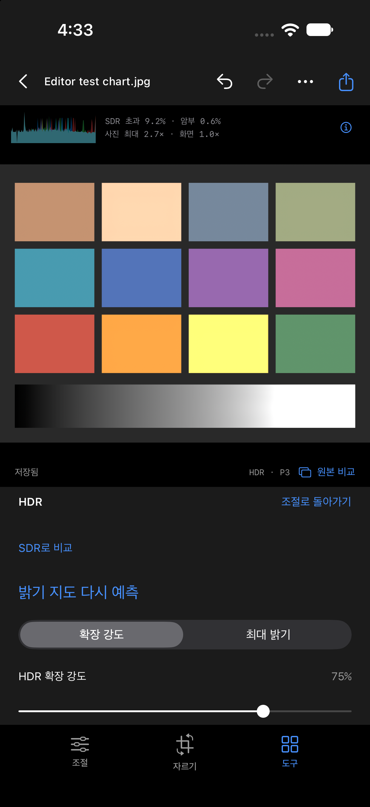

# HDR 붉은 색조 수정

2026-09-29. 사용자 보고: HDR이 반복해서 붉게 보임.

## 재현한 원인

Core ML의 단일 채널 log gain 텐서를 `CIFormat.Rf`로 변환하면 RGBA 값은 `(v, 0, 0, 1)`입니다. 이전 구현은 이를 회색 `(v, v, v, 1)`으로 잘못 취급했습니다. PNG 저장 후에도 G/B가 0이므로 지수 변환 후 R에는 예측 배율이, G/B에는 1이 적용됐습니다. 모델이 예측한 값이 하나인데 빨강만 증폭되는 구현 버그였습니다.

로컬 합성 probe: 입력 0.5 → Rf `(0.5, 0, 0, 1)` → PNG 재읽기 `(0.5000076, 0, 0, 1)`.

앞선 회색/색 비율 테스트는 RGB 회색으로 만든 가짜 지도를 사용해 통과했습니다. 실제 모델 왕복 테스트도 HDR 픽셀이 1을 넘는지만 확인했습니다. 이 검증 공백 때문에 색 오류를 놓쳤습니다. 중간톤 보호와 모델 실행 경로 검증만으로 이 문제를 해결할 수 없었습니다.

## 수정

`GainMapPipeline.scalarMap`이 R 값을 RGB 모두에 복제하고 alpha 1로 고정합니다. 알파 바이어스로 extent가 무한해지지 않도록 원래 지도 영역으로 자릅니다.

- 신규 PNG 저장 전에 스칼라를 RGB로 복제합니다.
- 적용할 때도 R에서 복제하므로 이미 저장된 이전 지도는 재예측 없이 정상 작동합니다.
- 기존 원본, 지도 파일, 편집 이력은 변경하지 않습니다. 이전에 외부로 내보낸 붉은 이미지 자체가 복구되는 것은 아니며 앱 프로젝트에서 다시 저장해야 합니다.

## 회귀 검증

`./Scripts/verify.sh`: **68개 테스트 / 11개 suite 통과**, iOS Simulator 빌드 성공. 서명 iPhone Release 빌드 성공.

`GainMapTests`에 실제 Rf 입력 → 저장/재읽기, 이전 버전의 R 전용 PNG, 중간톤 보호 on/off 경로를 추가했습니다. 회색의 채널 일치와 유색 표본의 RGB 비율을 검사합니다. 실제 번들 모델로 예측한 지도 → 엔진 처리 → HDR CGImage 프리뷰 → JPEG/HEIC 저장 및 HDR 재읽기에서도 중성 회색의 세 채널을 검사합니다.

이전 테스트에 단순히 허용 오차를 늘린 변경이 아닙니다. RGB 회색 지도만 테스트하던 것을 실제 단일 채널 표현으로 확장했습니다.

## 로컬 실사진 왕복

[보고서](hdr-red-cast-local-photo-report.json). 사용자 제공 노을 JPEG는 원래 HDR이어서 명시적으로 SDR 입력을 만든 후 예측했습니다. macOS 엔진에서만 실행했으며 사용자 사진은 저장소에 추가하지 않았습니다. 실제 출력 위치는 `/private/tmp/velyn-hdr-scalar-fixed/`입니다.

| 측정 | SDR | 수정 후 보호 끔 | 수정 후 보호 켬 |
| --- | ---: | ---: | ---: |
| 평균 선형 휘도 | 0.28505 | 0.39570 | 0.31633 |
| 최대 RGB 채널 | 0.9915× | 1.8604× | 1.8086× |
| SDR 범위 초과 | 0% | 8.42% | 4.70% |

JPEG/HEIC에는 gain map이 존재하고 HDR 재읽기 최대값은 각각 1.8023×/1.8015×입니다. 원본 해시 보존을 확인했습니다. 앞선 붉은 색조 수정 이전의 휘도 수치와 구분해야 합니다. 수치가 달라진 이유는 이제 G/B에도 올바른 gain이 적용되기 때문입니다.

실제 iPhone의 시각적 품질, 디스플레이 tone mapping, 장면별 모델 품질 및 발열 수락과는 별개의 검증입니다. 모델 재학습이나 원래 장면의 휘도 복원이라고 주장하지 않습니다.

## Simulator 프리뷰 수치와 화면

[프로그램 workflow 보고서](hdr-red-cast-simulator-report.json). 합성 회색 그라데이션의 세 지점에서 RGB가 각각 `(0.43018, 0.43018, 0.43018)`, `(1.09082, 1.09082, 1.09082)`, `(2.45703, 2.45703, 2.45703)`으로 일치했습니다. 실제 HDR 값과 중성색을 함께 확인했습니다. SDR 비교의 문서 보존 및 저장/undo/redo도 통과했습니다.

## 기기 배포

iPhone 15 Pro에 수정한 서명 Release 설치 및 실행 성공. 배포 기록: `.work/hdr-red-cast-install.json`, `.work/hdr-red-cast-launch.json`. 기기 화면의 실제 색을 측정한 결과는 아닙니다.
