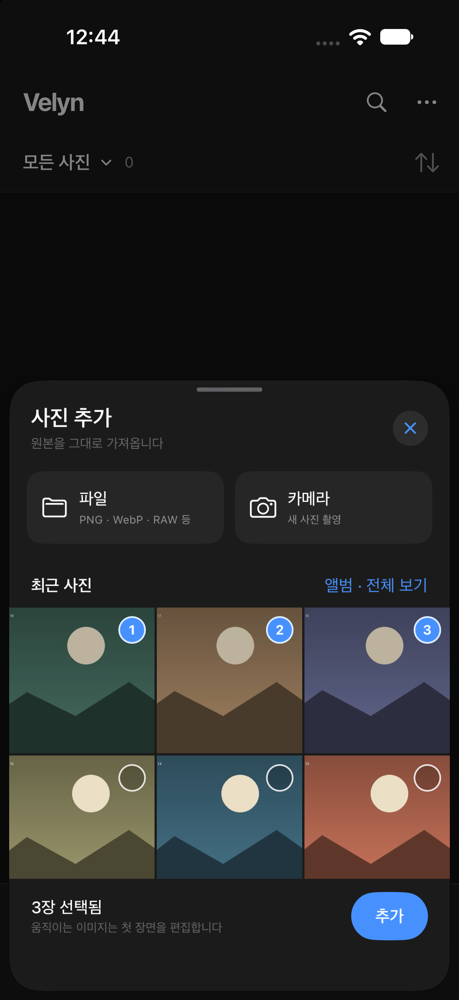
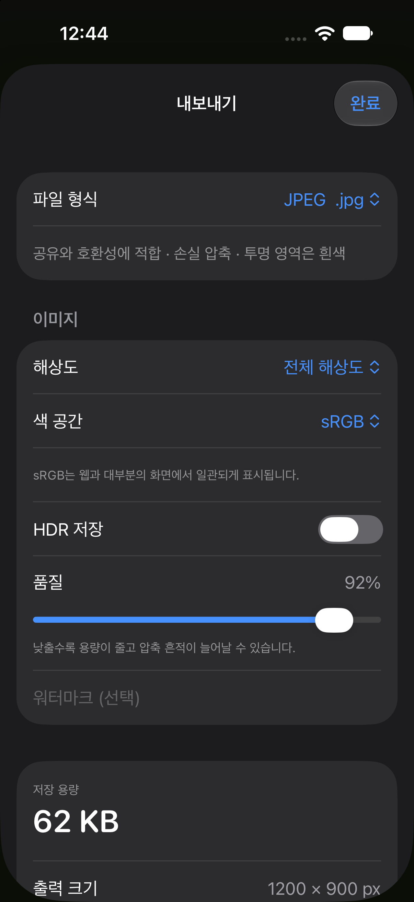

# 이미지 형식·사진 선택·저장 정보 검증

2026-09-29, Xcode 27 / Swift 6.4. 모든 표본은 코드로 만든 합성 이미지입니다.

## 결과

- `./Scripts/verify.sh` 성공: 54 tests / 7 suites, iOS Simulator build 성공.
- 서명된 iOS Release build 성공. 기존 설치와 같은 bundle ID `<LOCAL_BUNDLE_IDENTIFIER>`를 유지합니다.
- PNG/TIFF/GIF/BMP/AVIF/JPEG 2000의 내용 기반 가져오기, 원본 SHA 검증, 편집 렌더 성공.
- 별도 lossless RGBA WebP fixture의 가져오기·편집·원본 바이트 복사 성공.
- 2프레임 GIF의 원본 프레임 수 보존과 단일 프레임 PNG 보정본 출력 성공.
- JPEG/HEIC/PNG/AVIF/TIFF의 실제 인코딩 용량과 저장 복사본 byte count 일치.
- PNG/AVIF/TIFF 알파 보존, JPEG/HEIC 불투명 출력, 100×100 자르기·리사이즈와 임시 파일 정리 확인.
- 기존 PNG 거부 테스트는 실제 미지원 TGA 거부 검사로 변경했고, PhotoKit PNG/WebP/TIFF/GIF 원본 선택을 확인했습니다.

## 형식 범위

가져오기: JPEG, HEIC/HEIF, PNG, WebP, TIFF, GIF, BMP, AVIF, JPEG XL, JPEG 2000, 설치된 RAW 디코더 지원 형식.
JPEG XL과 각 제조사의 모든 RAW 변종을 합성 테스트로 검증한 것은 아닙니다. 실제 OS 디코더가 읽지 못하면 오류로 안내합니다.

엔진 출력: JPEG, HEIC, PNG, AVIF, TIFF. 후속 UI 개편으로 저장 선택지는 JPEG·PNG·HEIC·원본 네 가지로 제한했습니다. [현재 UI 검증](focused-editor-verification.md)을 참조하세요.
WebP의 기본 ImageIO writer가 없어 보정본 WebP 인코더는 포함하지 않았습니다. WebP 가져오기 및 원본 그대로 저장은 지원합니다.
GIF와 여러 프레임 입력의 편집 결과는 대표 장면 한 장입니다. 원본 내보내기는 프레임을 그대로 보존합니다.

## 용량 정보

설정 변경 후 550ms 동안 대기하고 전체 출력 파일을 기기에서 준비합니다. 화면에 표시한 용량은 이 파일의 실제 byte count이며, 파일 저장은 해당 파일을 복사해 재사용합니다. 사진 저장은 준비한 파일을 PhotoKit에 전달합니다. 사진 앱/iCloud 등 이후 저장 매체의 관리 용량까지 보장하지는 않습니다.

파일 형식별 압축·투명도·호환성 설명, 출력 크기·확장자, 색 공간·HDR·메타데이터 정책을 표시합니다. PNG 등의 무손실 형식에는 손실 압축 품질 슬라이더를 표시하지 않습니다.

## 화면 확인

개인 사진이 없는 별도 `Velyn Import UI Test` 시뮬레이터에 `Scripts/make-picker-fixtures.py`의 합성 JPEG 18장을 넣었습니다. PhotoKit이 반환한 실제 썸네일과 선택 순서 1·2·3, 선택 개수, 파일/카메라·전체 앨범 버튼을 확인했습니다.

`EditorSmokeFixture`의 합성 차트로 저장 화면을 열었습니다. JPEG 92%, 1200×900 출력의 실제 계산 용량 62KB 표시를 확인했습니다.

자동 진입/선택 상태 인자를 사용한 화면 검사입니다. 모든 버튼의 실제 터치, 거부·제한 권한 변경, 파일 공급자·Photos 저장의 모든 경우를 검증했다는 뜻은 아닙니다.

## 실기기 업데이트 상태

서명 앱은 `.work/iPhoneBuild/Build/Products/Release-iphoneos/Velyn.app`에 준비되어 있습니다.
화면 검증 시점에 iPhone의 무선 tunnel이 unavailable 상태여서 업데이트 연결을 요청했습니다. 기기의 기존 앱과 원본 데이터는 삭제하지 않았습니다.
