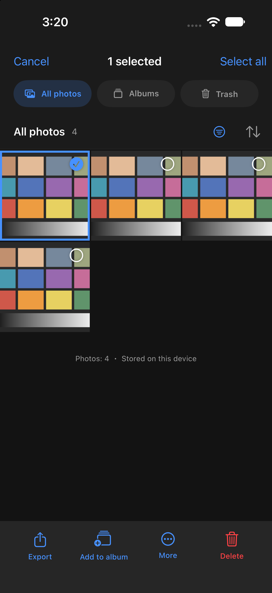
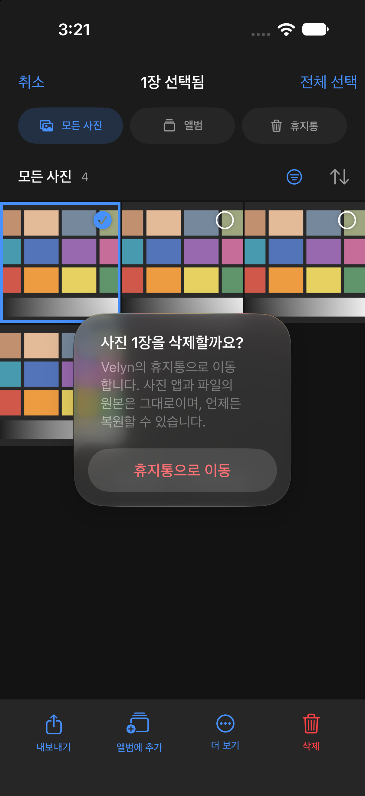

# Library usability and HDR reference audit

2026-10-01. The user reported difficulty finding library actions and a large difference between generated and native HDR.

## Library changes

- Select is visible on the main screen. Selection shows a count, Select all / Deselect all, and explicit Export, Add to album, More, and Delete actions.
- All photos, Albums, and Trash are directly accessible. When every photo is trashed, the empty state explains how to restore them. A photo's context menu offers selection and deletion, or restoration in Trash.
- Deletion confirms the captured photo IDs and moves them to Velyn's reversible trash. The completion notice offers Undo. Original files in Photos and Files are unaffected.
- Selection is restricted to visible photos when a search/filter changes. Reset clears format, rating, pick, album, trash, and search conditions.
- Albums have a dedicated creation/addition sheet and a deletion confirmation explaining that photos remain in the library. Failed actions preserve selection.
- The import sheet shows the selected count on Add, offers Deselect all and Retry, and confirms abandoning a selection when closing or switching to Files/Camera. Opening the system album picker retains existing selections and combines the chosen IDs without duplicates; the 100-photo limit remains.
- App text is available in Korean and English. Persistent enum values are unchanged.

## What caused the HDR mismatch?

The previous red-channel bug has a separate regression suite. Those checks establish neutral RGB and valid HDR files; they do not establish accuracy against native HDR.

This audit uses one real, user-provided HDR JPEG and its own embedded SDR base. Core Image reads the native HDR as the reference and the embedded SDR without HDR expansion or HDR-to-SDR tone mapping. The SDR base is encoded as a local 16-bit P3 PNG and imported through the normal service. The original's SHA-256 remains unchanged. Neither the photo nor derived tensors/previews are included in the repository.

### Paired result on macOS

[Numeric report](hdr-reference-audit.json). Linear sRGB luminance is sampled at a 256-pixel long edge. Mean luminance ratios use all sampled pixels. EV error and gain correlation exclude nearly black pixels (SDR/reference luminance at or below 0.01). These are image-content measurements, not screen nits or a perceptual quality score.

| Output | Mean luminance / native HDR | Mean absolute error | 95th percentile error |
| --- | ---: | ---: | ---: |
| Embedded SDR | 0.807 | 0.238 EV | 0.523 EV |
| App defaults: 75%, 4× cap, midtone protection | 0.899 | 0.140 EV | 0.223 EV |
| Full model gain: 100%, 5× cap, protection off | 1.251 | 0.302 EV | 0.435 EV |

In this photo the default improves on SDR but remains dimmer than native HDR. Applying the full model gain overshoots. Increasing strength alone is therefore not a demonstrated fix.

### Model conversion

The original GMNet PyTorch checkpoint and CPU Core ML receive the exact same photo-derived tensors. Their predicted log gains differ by **0.000983 EV on average**, **0.00455 EV at the 99th percentile**, and **0.00941 EV maximum**. This is much smaller than the measured HDR reconstruction difference. It does not validate every scene or device compute backend.

The current integration uses a 512-pixel local proxy with edge padding and a 256-pixel global thumbnail. The [upstream real-image pipeline](https://github.com/qtlark/GMNet) evaluates higher-resolution inputs and uses a gamma-2.2 SDR reconstruction convention. Velyn renders in a color-managed linear sRGB working space and adds its own strength, cap, and midtone protection. The result is an adapted predictor, not an exact reproduction of the authors' evaluation pipeline or a recovery of camera HDR. General model quality and these integration choices require a larger paired corpus to separate reliably.

## Changes to HDR behavior

- Store a fingerprint of the edit state used for prediction. Color, RAW development, masks, and removal changes can make a map stale; the HDR panel now indicates that it should be regenerated. Geometry, vignette, and display gain settings do not require a new prediction.
- Fingerprint serialization/hashing runs on a dedicated actor with reuse for unchanged prediction inputs. Cancelled view tasks discard stale results.
- Old documents/maps still load. A missing fingerprint prompts regeneration without replacing the stored map.
- Regeneration preserves strength, brightness cap, and midtone protection instead of resetting them.
- The panel labels SDR-derived HDR as an estimate and exposes the default tone-preserving and full-model settings explicitly. Files that already contain HDR continue using their original HDR data.
- Model weights and gain math are unchanged. No per-photo constant was fitted to this sample. This update does not claim native HDR fidelity has been solved.

## Reproduction

All photo-derived output should be directed outside the repository:

```sh
swiftc -O -parse-as-library $(rg --files Velyn/Engine -g '*.swift') \
  Scripts/audit-hdr-reference.swift -o .work/hdr-reference-audit
.work/hdr-reference-audit /path/to/native-hdr.jpg /private/tmp/hdr-audit \
  Velyn/Models/VelynGainMap.mlpackage
python Scripts/compare-gain-model.py /path/to/G_realworld.pth /private/tmp/hdr-audit
```

The Python comparison requires the explicitly supplied pinned checkpoint and the conversion environment described in `Scripts/Models/convert_gain_map.py`. It performs no downloads. The generated −2 EV JPEGs use a common viewing scale; they are not HDR display captures.

## Validation

- `./Scripts/verify.sh`: 72 engine tests, including prediction-state fingerprint and backward-compatible decoding, plus actual-model neutral RGB and HDR JPEG/HEIC regressions.
- The opt-in `--library-smoke-test` runs programmatic view-model/service actions in a separate simulator store, using the generated `EditorSmokeFixture` chart. It covers hidden-selection exclusion, delete, undo, trash filtering, failed-action retention, album add/remove, filter reset, and SHA-256 verification of originals.
- [Library workflow report](library-usability-simulator.json): every recorded check passed. [HDR regeneration report](hdr-regeneration-simulator.json): changed-edit detection, refreshed fingerprint, retained settings, undo/redo, save, JPEG/HEIC, and neutral RGB passed.
- Visual inspection uses simulator captures in Korean and English. It is not a manual touch test or physical-device UX acceptance.

Physical-device HDR appearance, scene-by-scene quality, heat, and acceptance gates C01–C10 remain open.

The signed iPhone Release build succeeded (1.0.1, build 3). Update installation could not establish the required trusted device connection (`CoreDeviceError 4016`); this build has not been run on the physical iPhone.

| Selection actions (English) | Deletion confirmation (Korean) |
| --- | --- |
|  |  |

These screenshots contain only the programmatically generated chart. They demonstrate layout, not photo quality.
