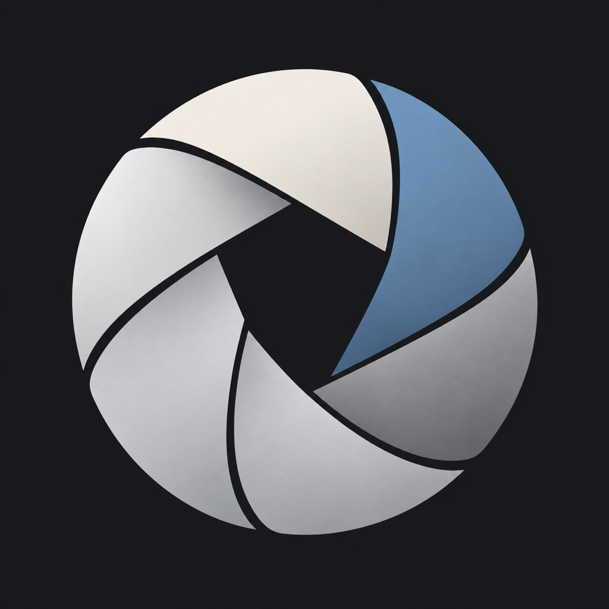
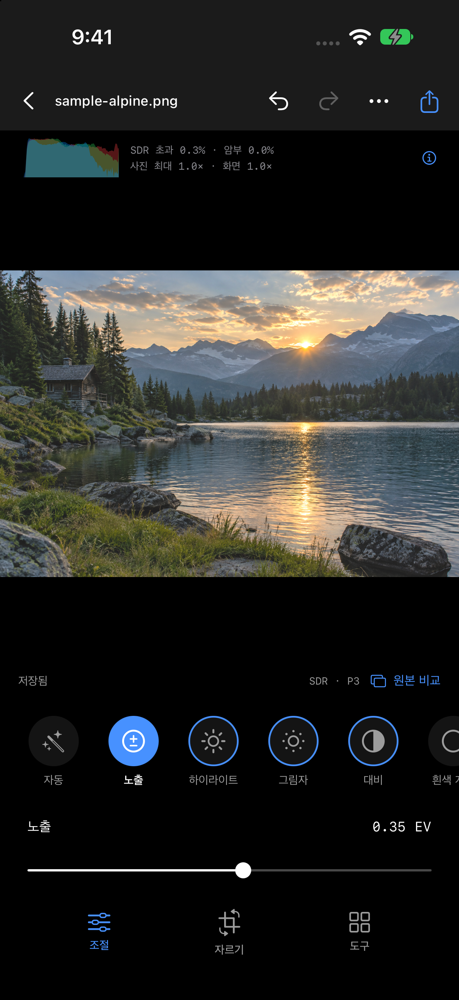
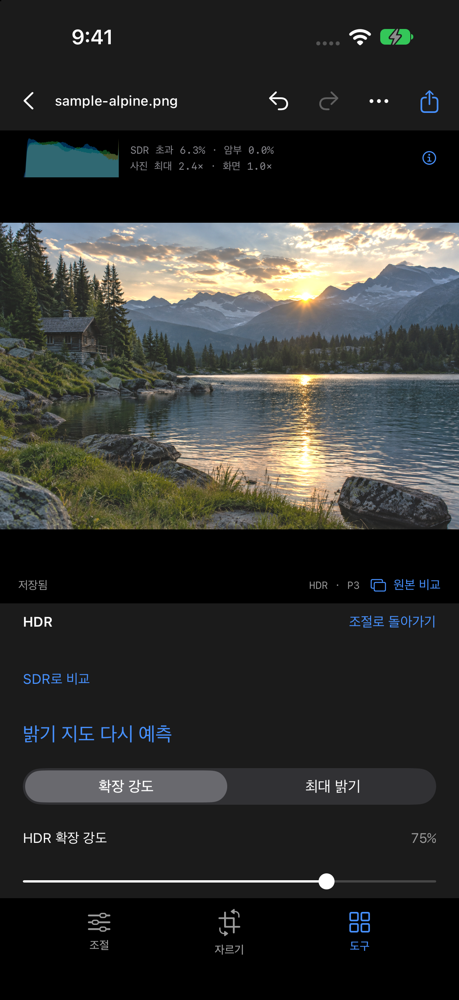
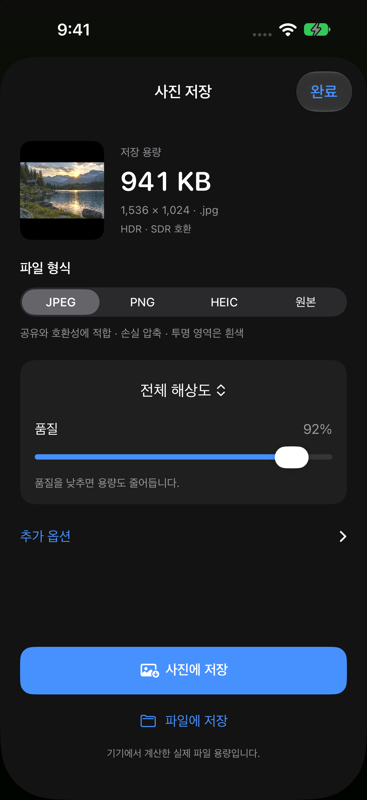
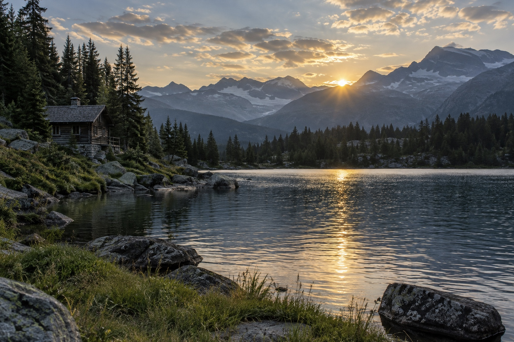
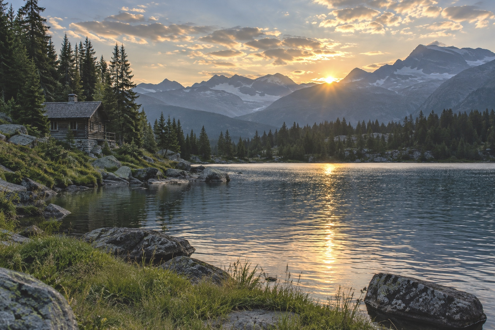
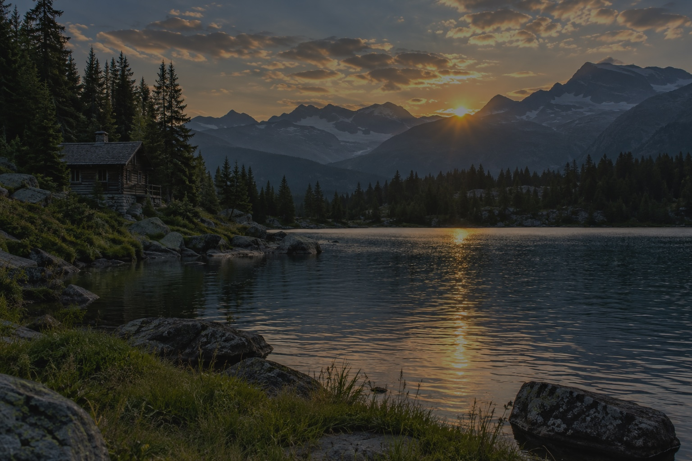
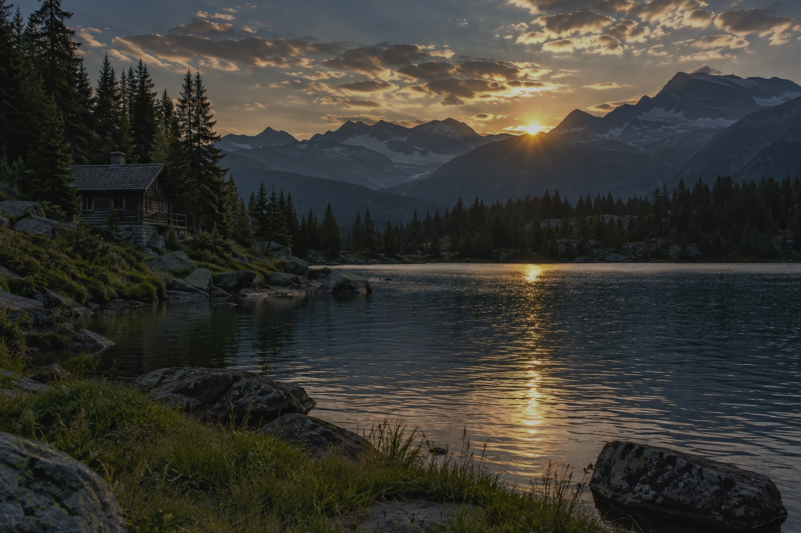
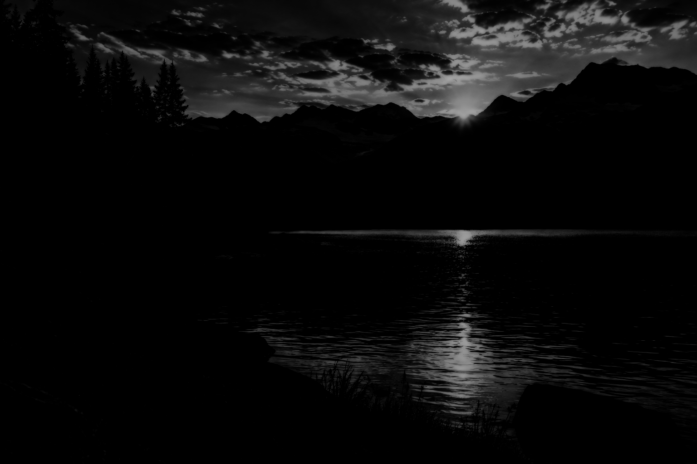

<p align="center">
  
</p>
<h1 align="center">Velyn</h1>
<p align="center"><strong>원본을 지키는, 기기 안의 사진 편집실.</strong></p>
<p align="center">RAW 현상 · 빛과 색 보정 · 로컬 요소 지우기 · SDR → HDR</p>
<p align="center">
  <a href="#앱-둘러보기">앱 화면</a> ·
  <a href="#보정-전후">보정 예시</a> ·
  <a href="#sdr-사진에-hdr-추가하기">HDR 예시</a> ·
  <a href="#시작하기">빌드하기</a> ·
  <a href="LICENSE">MIT License</a>
</p>

---

Velyn은 사진을 **iPhone 안에서 처리하는 편집기**입니다. 가져온 원본을 바이트 그대로 보관하고, 보정 기록과 출력 이미지를 별도로 저장합니다. 앱 서버·사진 업로드·로그인·광고 SDK가 없습니다.

## 앱 둘러보기

<table>
  <tr>
    <th>사진을 크게 보며 보정</th>
    <th>HDR 밝기 지도</th>
    <th>출력을 확인하고 저장</th>
  </tr>
  <tr>
    <td></td>
    <td></td>
    <td></td>
  </tr>
</table>

실제 앱을 iOS 27 시뮬레이터에서 촬영했습니다. 아래 사진은 README용 **AI 생성 샘플**이며, 보정 결과와 HDR 파일은 **Velyn의 실제 엔진 출력**입니다. 사용자 사진은 포함하지 않았습니다.

## 보정 전후

노출과 그림자를 조절하고, 하이라이트·생동감·색온도를 다듬은 예시입니다. 두 이미지는 같은 입력에서 만들어졌습니다.

| 보정 전 | Velyn 보정 후 |
| :---: | :---: |
|  |  |

**적용 설정:** 노출 `+0.35 EV` · 그림자 `+24` · 하이라이트 `−20` · 대비 `−6` · 생동감 `+16` · 색온도 `+4` · 명료도 `+4`.

[보정 전 크게 보기](Docs/Images/alpine-before.jpg) · [보정 후 크게 보기](Docs/Images/alpine-after.jpg) · [입력·설정·재현 방법](Docs/Images/README.md)

## SDR 사진에 HDR 추가하기

기기에 포함된 **GMNet**이 밝기 지도를 예측하고, Velyn이 선형 RGB에 같은 배율을 적용합니다. 확장 강도·최대 배율·중간톤 보호를 조절할 수 있습니다. 아래 예시는 보정한 SDR 사진에 강도 **75%**, 최대 배율 **4×**, **중간톤 보호 켬**을 적용했습니다.

| 보정한 SDR | HDR 확장 결과 | 실제 적용 배율 지도 |
| :---: | :---: | :---: |
|  |  |  |

**웹용 비교 안내:** 왼쪽 두 이미지는 SDR 화면에서도 상대적인 차이를 볼 수 있도록 둘 다 선형 밝기를 **1/4(−2 EV)**로 줄였습니다. 실제 HDR 화면을 캡처한 이미지가 아닙니다. 배율 지도는 검정 `1×` → 흰색 `4×`의 로그 스케일입니다.

### HDR 파일 직접 보기

- **[HDR JPEG 다운로드](https://raw.githubusercontent.com/H4RUming/Velyn/main/Docs/Images/alpine-hdr.jpg)**
- **[HDR HEIC 다운로드](https://raw.githubusercontent.com/H4RUming/Velyn/main/Docs/Images/alpine-hdr.heic)**

두 파일 모두 SDR 기본 이미지와 HDR gain map을 포함합니다. 다운로드 후 HDR을 지원하는 기기·뷰어에서 열어보세요. GitHub 미리보기는 SDR로 표시될 수 있으며, 실제 밝기는 화면과 시스템의 HDR 여유에 따라 달라집니다.

밝기 지도는 **추정 결과**입니다. 소실된 하이라이트 디테일이나 원래 장면의 실제 휘도를 복원한다고 보장하지 않습니다. [실행 수치](Docs/Images/report.json) · [HDR 색상 회귀 검증](Docs/Evidence/hdr-red-cast-verification.md)

## 편집 도구

| 영역 | 할 수 있는 작업 |
| --- | --- |
| **RAW 현상** | 지원 디코더의 화이트밸런스·현상 톤·노이즈·디테일 조절, 원본 보존 |
| **빛과 색** | 노출·대비·하이라이트·그림자, RGB 커브, 8색 HSL, 3영역 그레이딩, 자동/스포이트 WB |
| **디테일·구도** | 텍스처·명료도·안개·선명도·노이즈, 자르기·회전·수평·수동 원근/왜곡 |
| **부분 보정** | 브러시·선형·방사형·밝기/색 범위·피사체·배경·탭 선택 마스크 |
| **요소 지우기** | 확대·이동하며 범위를 칠하고 지운 뒤 명시적으로 실행하는 로컬 제거 |
| **깊이·색역·HDR** | 깊이 기반 렌즈 흐림, P3 색역 확장, SDR → HDR 밝기 지도 예측 |
| **사진 관리** | 앨범·별점·선별·복원 가능한 휴지통, 보정 복사·일괄 출력, 프리셋·버전·실행 취소 |
| **저장** | JPEG·PNG·HEIC·원본 네 가지 선택, 크기·색 공간·예상 용량 안내, PNG 16비트, HDR JPEG/HEIC |

PNG·WebP·TIFF·GIF·BMP·AVIF·JPEG XL·JPEG 2000·JPEG·HEIC·지원 RAW 가져오기를 지원합니다. 수동 ISO·셔터·초점 카메라와 지원 기기의 RAW/ProRAW 촬영 경로도 제공합니다.

드래그 중에는 최대 **30회/초·768px**, 조절을 멈추면 **1536px** 미리보기로 전환합니다. 실제 속도는 기기와 적용한 보정에 따라 달라집니다.

[전체 기능과 남은 작업](Docs/professional-roadmap.md) · [편집 엔진 동작 범위](Docs/editor-features.md)

## 사진과 모델은 어디에서 처리하나요?

| 기능 | 사용 모델·방식 |
| --- | --- |
| 요소 지우기 | AOT-GAN · 앱에 포함 |
| 깊이 추정 | Depth Anything V2 Small · 앱에 포함 |
| HDR 밝기 지도 | GMNet · 앱에 포함, Core ML 변환 |
| 피사체·탭 선택 | Apple Vision · 탭 선택 모델 준비는 사용자 요청 시 |
| P3 색역 확장 | 분석적 보간 · 신경망 미사용 |

모두 기기에서 사진을 처리합니다. 자체 학습한 신경망은 없으며, 외부 모델과 Velyn의 편집·합성·저장 엔진을 조합합니다. [모델 출처·라이선스](Velyn/Notices/Models-NOTICE.txt)

Apple 탭 선택 모델은 **선택 모델 준비**를 눌렀을 때만 내려받습니다. 앱 실행·가져오기 시 자동 다운로드하지 않습니다. PhotoKit 가져오기는 네트워크 접근을 끄므로 iCloud 전용 사진은 사진 앱에서 원본을 먼저 내려받아야 합니다. 파일 공급자 다운로드와 공유·저장은 사용자가 선택한 시스템 경로를 따릅니다.

## 시작하기

**필요 환경:** Xcode 27 · iOS 27 · macOS의 Swift 테스트 환경. 저장소에는 약 109MiB의 로컬 모델이 포함됩니다.

```sh
git clone https://github.com/H4RUming/Velyn.git
cd Velyn
open Velyn.xcodeproj
```

1. `Velyn` scheme과 iPhone 시뮬레이터를 선택해 실행합니다.
2. 실기기 설치 시 `Config/Local.xcconfig.example`을 `Config/Local.xcconfig`로 복사하고 개발 팀·고유 Bundle ID를 입력합니다. 개인 설정은 Git에서 제외됩니다.
3. **사진 추가**에서 사진 보관함·파일·카메라를 선택합니다.
4. 사진을 열어 보정하고 공유 버튼에서 출력 형식을 선택합니다.

## 검증 상태

```sh
./Scripts/verify.sh
```

**68개 엔진 테스트 통과.** iOS Simulator·기기 대상 빌드, 실제 모델 추론, 원본 보존, HDR gain map 왕복 및 중성색 유지 등을 검사합니다. README 예제는 macOS 엔진에서 생성했으며 A17 Pro 성능 측정 결과가 아닙니다.

실기기의 다양한 ProRAW·카메라·화면 색 정확도·장시간 발열 및 시스템 선택/저장 UI의 전체 검증은 진행 중입니다. Lightroom과 동일한 알고리즘·품질 또는 출시 수락 완료를 의미하지 않습니다.

[검증 기록](Docs/Evidence/professional-verification.md) · [SDK 확인](Docs/api-availability.md) · [HDR 수정 검증](Docs/Evidence/hdr-red-cast-verification.md) · [RAW 현상 검증](Docs/Evidence/raw-development-verification.md)

## 원본 보관

원본과 메타데이터는 `Application Support/Velyn/Projects/<UUID>/`에 보관됩니다. 보정 출력은 GPS를 제거하고, **원본 내보내기**는 원래 메타데이터를 유지합니다.

**앱 데이터는 시스템 백업에서 제외됩니다.** 앱 삭제·기기 분실에 대비해 원본을 별도로 보관하세요. 휴지통은 자동으로 비워지지 않습니다.

## 라이선스

Velyn 자체 코드는 [MIT License](LICENSE)입니다. 외부 모델·코드는 각 [원래 라이선스](Velyn/Notices/Models-NOTICE.txt)를 따릅니다. 앱 아이콘과 README 합성 사진의 출처·재현 방법은 [이미지 안내](Docs/Images/README.md)에 있습니다.
