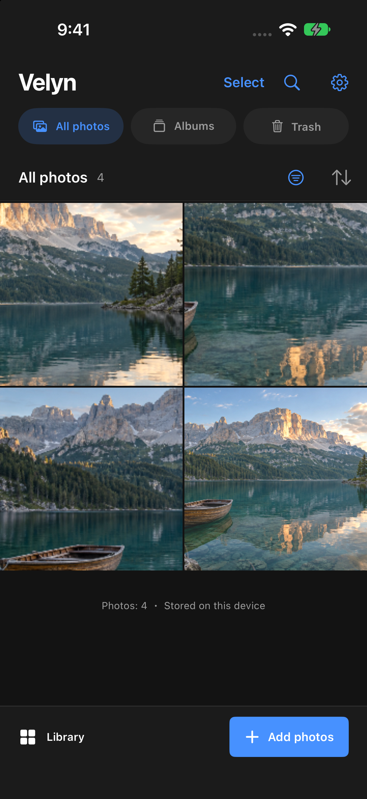
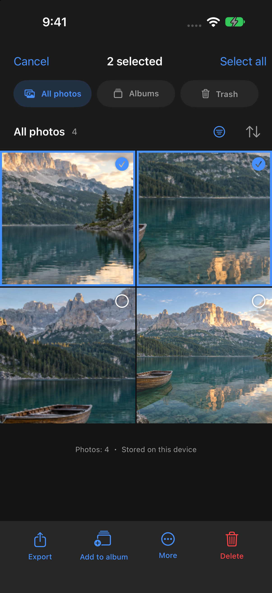
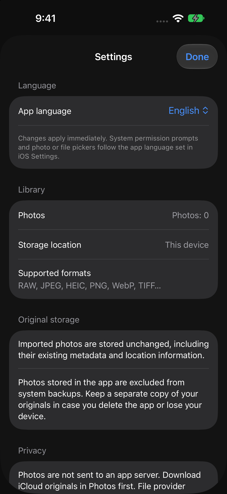

<p align="center">
  
</p>
<h1 align="center">Velyn</h1>
<p align="center"><strong>A photo editor that keeps your photos on your iPhone.</strong></p>
<p align="center">RAW development · Color and light · Object removal · SDR to HDR</p>
<p align="center">
  <a href="#inside-the-app">Screenshots</a> ·
  <a href="#before-and-after">Editing example</a> ·
  <a href="#adding-hdr-to-an-sdr-photo">HDR example</a> ·
  <a href="#build-and-run">Build instructions</a> ·
  <a href="LICENSE">MIT License</a>
</p>

---

Velyn is an iPhone photo editor with local processing and nondestructive edits. Imported originals are kept byte for byte; edits and exports are saved separately. There is no app server, photo upload, account, or advertising SDK.

**[Download v1.2.0](https://github.com/H4RUming/Velyn/releases/tag/v1.2.0)** — iOS 27 or later. The release includes an unsigned IPA for signing with AltStore Classic or your own signing workflow. Apple Configurator requires an already signed IPA. See the [installation guide](Docs/Releases/INSTALL.md).

## Inside the app

<table>
  <tr><th>Your library</th><th>Select and organize</th><th>Keep the photo in view</th></tr>
  <tr>
    <td></td>
    <td></td>
    <td></td>
  </tr>
  <tr><th>Adjust HDR</th><th>Choose an export</th><th>Make it yours</th></tr>
  <tr>
    <td></td>
    <td></td>
    <td></td>
  </tr>
</table>

These are fresh **v1.1 screenshots from the iOS 27 Simulator**. The landscape is an AI-generated demo image; the library includes crop and color variants made by Velyn. Every edit and HDR export below comes from the app's engine. No user photos are included.

The app supports **English and Korean**. Use the gear icon in the library, then **App language**. System permission dialogs and photo/file pickers follow the app's iOS language setting.

### What's new in v1.2

- Camera-adapted GMNet, with 1024px inference on supported Neural Engine devices and a calibrated 512px fallback.
- New predictions use the learned gain without the previous default tone reduction. Strength and midtone protection remain adjustable.
- Existing edits stay intact. Use **Predict gain map again**, then **Full model gain**, to try the updated model and defaults on an older edit.

[Release notes and installation](Docs/Releases/v1.2.0.md)

### Earlier changes in v1.1

- **More balanced HDR expansion.** Tone protection adapts to the scene's contrast, and gain-map enlargement follows image edges to reduce bleeding. In a small eight-pair local audit, mean luminance error fell by 15.6%. [Results and limits](Docs/Evidence/hdr-v11-quality.md).
- **Clearer library actions.** Select, delete, undo, restore, and add to albums are easier to find. Changing a filter no longer leaves hidden photos selected.
- **Safer regeneration.** The app marks gain maps that no longer match the edits and keeps your strength settings when you predict again. Existing maps keep their previous rendering until regenerated.

## Before and after

A small exposure lift, more detail in the shadows, and a few color adjustments. Both exports use the same source image.

| Before | After |
| :---: | :---: |
|  |  |

**Settings:** Exposure `+0.35 EV` · Shadows `+24` · Highlights `−20` · Contrast `−6` · Vibrance `+16` · Warmth `+4` · Clarity `+4`.

[Full-size before](Docs/Images/alpine-before.jpg) · [Full-size after](Docs/Images/alpine-after.jpg) · [Source and reproduction steps](Docs/Images/README.md)

## Adding HDR to an SDR photo

The bundled **GMNet** model predicts a gain map. Velyn applies that map to linear RGB, using the same multiplier for all three color channels. In v1.2, GMNet is fine-tuned on native camera HDR/SDR pairs. New predictions use full strength, a 5× ceiling, and optional midtone protection. Existing maps keep their saved settings. The examples below were rendered with v1.1; see the [v1.2 measurements](Docs/Evidence/hdr-camera-integration.md) for the new model.

This example starts with the edited SDR image above: **75% strength**, **4× maximum gain**, **midtone protection on**.

| Edited SDR | With HDR expansion | Applied gain |
| :---: | :---: | :---: |
|  |  |  |

**About this comparison:** Both photos have been reduced to <strong>one quarter of their linear brightness (−2 EV)</strong> so the relative difference is visible on an SDR screen. They are explanatory previews, not captures of an HDR display. The map uses a logarithmic scale: black is `1×`, white is `4×`.

### Try the HDR files

- **[Download HDR JPEG](https://raw.githubusercontent.com/H4RUming/Velyn/main/Docs/Images/alpine-hdr.jpg)**
- **[Download HDR HEIC](https://raw.githubusercontent.com/H4RUming/Velyn/main/Docs/Images/alpine-hdr.heic)**

Both contain an SDR base image and an HDR gain map. Download them and open them in an HDR-capable viewer. GitHub may show only the SDR version; actual brightness depends on the display and its available HDR headroom.

The gain map is an estimate. It cannot reliably recover clipped detail or the scene's original luminance. [Measured output](Docs/Images/report.json) · [HDR color regression checks](Docs/Evidence/hdr-red-cast-verification.md) · [v1.1 comparison with native HDR](Docs/Evidence/hdr-v11-quality.md)

## Editing tools

| Area | Tools |
| --- | --- |
| **RAW development** | White balance, development tone, noise, and detail controls where supported by the decoder; original files preserved |
| **Light and color** | Exposure, contrast, highlights, shadows, RGB curves, eight-channel HSL, three-way color grading, auto and eyedropper white balance |
| **Detail and geometry** | Texture, clarity, dehaze, sharpening, noise reduction, crop, rotation, leveling, manual perspective and distortion correction |
| **Local adjustments** | Brush, linear, radial, luminance range, color range, subject, background, and tap selection masks |
| **Object removal** | Zoom and pan, paint or erase the selection, then run removal on the device |
| **Depth, gamut, and HDR** | Depth-based lens blur, P3 gamut expansion, SDR-to-HDR gain map prediction |
| **Library** | Albums, ratings, flags, recoverable trash, copy edits, batch export, presets, versions, and undo |
| **Export** | JPEG, PNG, HEIC, or the original file; dimensions, color space, and file-size estimates; 16-bit PNG and HDR JPEG/HEIC |

Imports include JPEG, HEIC, PNG, WebP, TIFF, GIF, BMP, AVIF, JPEG XL, JPEG 2000, and supported RAW formats. The camera provides manual ISO, shutter speed, and focus, with RAW/ProRAW capture on supported devices.

While you drag a control, previews use a 768px resolution and update at up to 30 frames per second. After you stop, the app renders a 1536px preview. Actual speed depends on the device and the edits in use.

[Feature status and remaining work](Docs/professional-roadmap.md) · [Editing engine details](Docs/editor-features.md)

## Models and local processing

| Feature | Implementation |
| --- | --- |
| Object removal | AOT-GAN, bundled with the app |
| Depth estimation | Depth Anything V2 Small, bundled with the app |
| HDR gain map | GMNet fine-tuned on native camera HDR/SDR pairs, bundled as Core ML |
| Subject and tap selection | Apple Vision; tap selection assets are downloaded on request |
| P3 gamut expansion | Analytical interpolation, without a neural network |

Velyn fine-tunes GMNet and uses the other models alongside its own editing and export code. New HDR predictions use the learned gain at full strength; midtone protection is optional. Existing edits keep their settings. On a repeatedly evaluated collection of 132 photos, the tuned model reduced mean luminance error from 0.488 to 0.328 EV. Some photos still regress, and iPhone display validation remains open. See the [integration checks](Docs/Evidence/hdr-camera-integration.md) and [training results](Docs/Evidence/hdr-gmnet-finetune-verification.md).

Download the [camera-adapted GMNet on Hugging Face](https://huggingface.co/H4RUming/Velyn-GMNet-Camera-v1) for PyTorch weights, Core ML packages, and local inference examples. The training photos remain private.

A separate model trained from scratch remains an experiment in the [research code](Scripts/HDR/Training/README.md). All app photo processing runs on the device. The repository includes converted model weights, without the private training photos or training checkpoint. See the [model sources and licenses](Velyn/Notices/Models-NOTICE.txt).

Apple's tap selection assets are downloaded only when you tap **Prepare model**. Launching the app or importing a photo does not trigger a model download. PhotoKit imports disable network access, so iCloud-only originals must first be downloaded in Photos. File provider downloads, sharing, and saving use the system services you choose.

## Build and run

**Requirements:** Xcode 27, iOS 27, and macOS for the Swift tests. The repository includes roughly 109 MiB of local models.

```sh
git clone https://github.com/H4RUming/Velyn.git
cd Velyn
open Velyn.xcodeproj
```

1. Select the `Velyn` scheme and an iPhone simulator, then run.
2. To install on a device, copy `Config/Local.xcconfig.example` to `Config/Local.xcconfig` and enter your development team and a unique bundle ID. This local file is excluded from Git.
3. Tap **Add photos** to import from Photos, Files, or the camera.
4. Open a photo, make your edits, and use the share button to choose an export format.

## Testing and current limits

```sh
./Scripts/verify.sh
```

The verification script passes **83 engine tests** and builds the iOS Simulator app. Tests cover original-file preservation, local model inference, HDR gain map round trips, neutral colors, localization, and other engine behavior. Device-target compilation is checked separately. The README examples were rendered on macOS; they are not A17 Pro benchmarks.

Work is still underway on broader physical-device testing: ProRAW variants, camera behavior, display color accuracy, sustained heat, and system import/export flows. The project has not passed all release acceptance gates or established Lightroom feature and quality parity. Most engineering notes linked below are currently in Korean.

[Verification records](Docs/Evidence/professional-verification.md) · [SDK availability](Docs/api-availability.md) · [HDR color checks](Docs/Evidence/hdr-red-cast-verification.md) · [RAW development checks](Docs/Evidence/raw-development-verification.md)

## Keeping your originals

Original files and metadata live in `Application Support/Velyn/Projects/<UUID>/`. Edited exports omit GPS metadata. Exporting the original preserves its existing metadata.

**The app's photo storage is excluded from system backups.** Keep another copy of your originals in case you delete the app or lose the device. The app does not empty its trash automatically.

## License

Velyn's own code is licensed under the [MIT License](LICENSE). Third-party models and code retain their [respective licenses](Velyn/Notices/Models-NOTICE.txt). Sources and reproduction steps for the icon and sample images are in the [image notes](Docs/Images/README.md).
